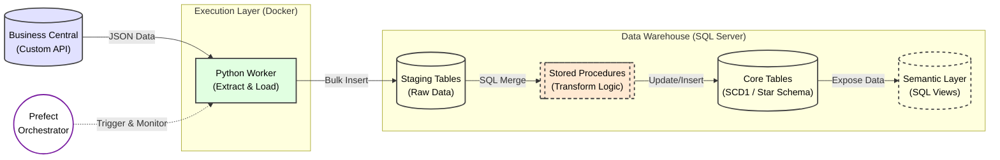

```mermaid
graph LR
    BC[("Business Central<br>(Custom API)")]
    
    subgraph "Execution Layer (Docker)"
        Py["Python Worker<br>(Extract & Load)"]
    end
    
    subgraph "Data Warehouse (SQL Server)"
        Staging[("Staging Tables<br>(Raw Data)")]
        SPs[["Stored Procedures<br>(Transform Logic)"]]
        Core[("Core Tables<br>(SCD1 / Star Schema)")]
        Views[("Semantic Layer<br>(SQL Views)")]
    end

    Prefect((Prefect<br>Orchestrator))

    %% Relaciones
    BC -->|JSON Data| Py
    Prefect -.->|Trigger & Monitor| Py
    Py -->|Bulk Insert| Staging
    Staging -->|SQL Merge| SPs
    SPs -->|Update/Insert| Core
    Core -->|Expose Data| Views


    style BC fill:#E1E1FF,stroke:#444,stroke-width:2px,color:#000
    style Py fill:#E1FFE1,stroke:#444,stroke-width:2px,color:#000
    style Staging fill:#FFFFE1,stroke:#444,stroke-width:2px,color:#000
    style Core fill:#FFFFE1,stroke:#444,stroke-width:2px,color:#000
    style SPs fill:#FFE9D2,stroke:#444,stroke-width:2px,stroke-dasharray: 5 5,color:#000
    style Views fill:#FFFFE1,stroke:#444,stroke-width:2px,stroke-dasharray: 5 5,color:#000
    style Prefect fill:#fff,stroke:#7B1FA2,stroke-width:2px,color:#000
```
